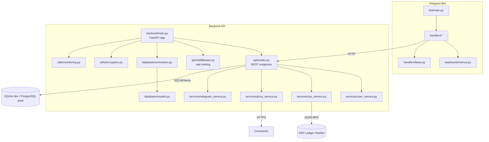
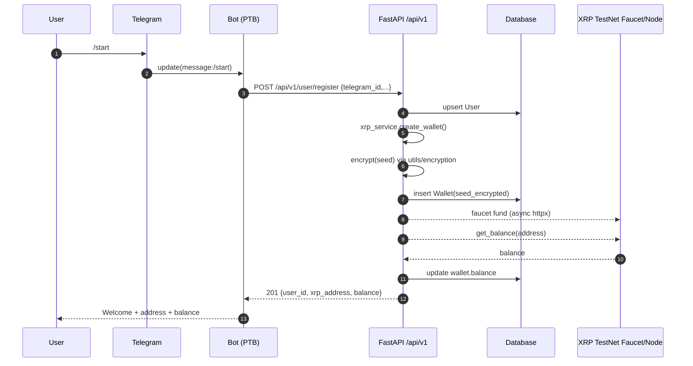
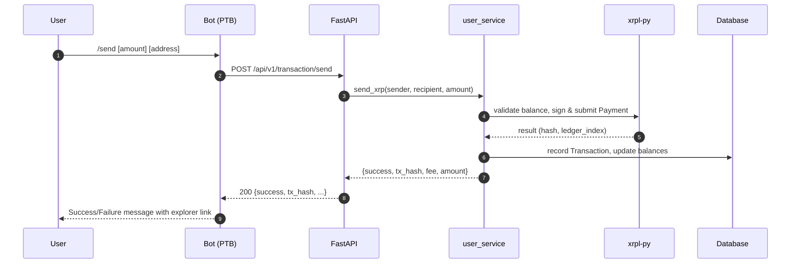
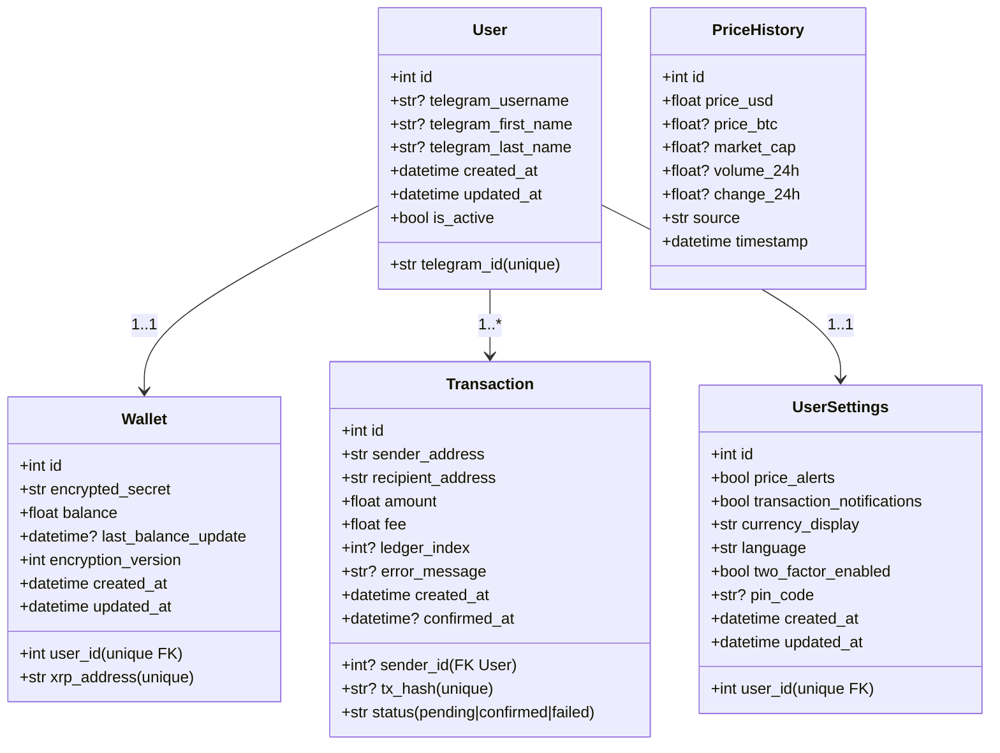
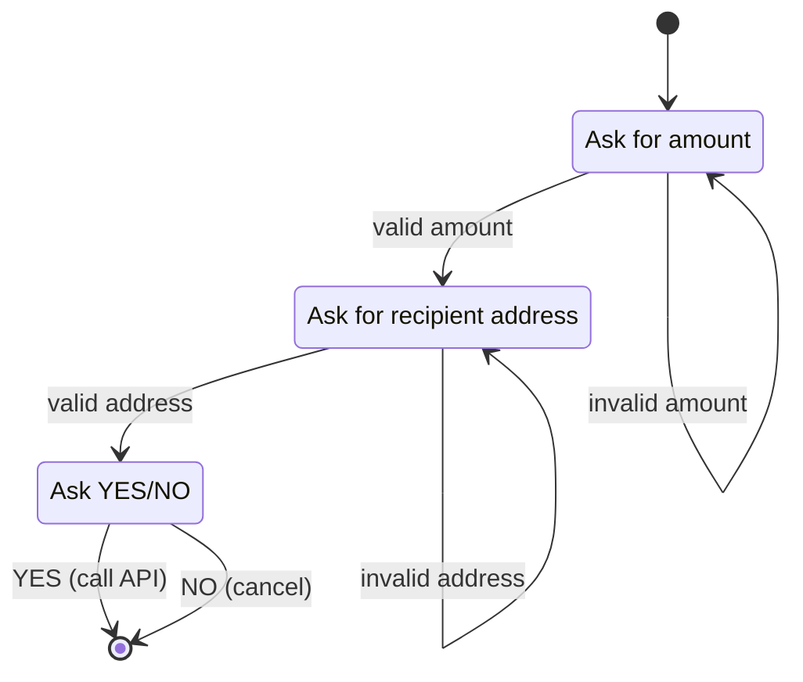

# XRP Telegram Bot — Architecture and Codebase Overview

Date: 2025-09-11

This document gives a deep, multi-angle overview of the project:
- Software architect: system context, components, data flow, cross-cutting concerns
- Software developer: module map, APIs, data models, extension points, testing & tooling
- Product manager: value proposition, personas, KPIs, roadmap, risks


## System context

```mermaid
graph LR
    U[User on Telegram] -->|Commands / Buttons| TG[Telegram Platform]
    TG -->|Webhook Updates| BOT[Telegram Bot (python-telegram-bot)]
    BOT -->|HTTP calls| API[FastAPI Backend]
    API --> DB[(SQLAlchemy<br/>SQLite/PostgreSQL)]
    API --> XRPL[XRP Ledger TestNet]
    API --> CG[CoinGecko API]

    classDef svc fill:#eef,stroke:#88a
    classDef ext fill:#ffe,stroke:#cc9
    class API,BOT svc
    class TG,XRPL,CG ext
```

Key facts
- TestNet only. The backend speaks to XRPL TestNet via `xrpl-py`.
- Custodial wallet model. User wallet seeds are encrypted at rest with Fernet.
- Two apps: `backend` (FastAPI) and `bot` (python-telegram-bot). They communicate over HTTP.
- Rate limiting via SlowAPI; optional monitoring hooks.


## High-level architecture



Highlights
- Separation of concerns: bot (UX) vs backend (business logic + persistence).
- Services layer hides XRPL, pricing, and Telegram externalities from API routes.
- Strict models with SQLAlchemy 2.0 and Pydantic v2 validation in API contracts.


## Runtime flows

### User registration and wallet creation (/start)


### Send funds (/send conversation)


### Price fetch
- Backend endpoint `/api/v1/price/current` queries CoinGecko via `httpx` and returns a compact price payload; bot uses this endpoint.


## Data model (SQLAlchemy)



Tables are defined in `backend/database/models.py` and created via `Base.metadata.create_all()` in `backend/database/connection.py`.


## API surface (FastAPI)

Base: `${API_URL}/api/v1`

- POST `/user/register`
  - Request: `{ telegram_id: str, telegram_username?: str, telegram_first_name?: str, telegram_last_name?: str }`
  - Response: `{ user_id: int, telegram_id: str, xrp_address: str, balance: Decimal }`
  - Rate limit: 5/hour

- GET `/wallet/balance/{telegram_id}`
  - Response: `{ address: str, balance: Decimal, available_balance: Decimal, last_updated?: str }`

- POST `/transaction/send`
  - Request: `{ from_telegram_id: str, to_address: str, amount: Decimal, memo?: str }`
  - Response: `{ success: bool, tx_hash?: str, fee?: Decimal, amount?: Decimal, ledger_index?: int, error?: str }`
  - Rate limit: 10/minute

- GET `/transaction/history/{telegram_id}?limit&offset`
  - Response: `{ transactions: [...], total_count: number }`

- GET `/price/current`
  - Response: `{ price_usd: Decimal, change_24h?: Decimal, market_cap?: Decimal, volume_24h?: Decimal, last_updated: ISO8601 }`

- GET `/health`
  - Validates DB connectivity and XRPL reachability.

Security options (present but not fully wired)
- API key headers via `backend/api/auth.py` (`X-API-Key` validated against `BOT_API_KEY` / `ADMIN_API_KEY`). Not currently enforced on routes.
- Rate limiting via `slowapi` decorators and global limiter in `backend/api/middleware.py`.

Telegram webhook
- `backend/api/webhook.py` provides a webhook handler under router prefix `/telegram` with signature verification. Note: this router is not included in `backend/main.py` yet; include it if you intend to run Telegram via backend webhooks.


## Bot command flows (python-telegram-bot v20)

Handlers in `bot/handlers/*` implement:
- `/start` → calls backend registration and replies with wallet info.
- `/help` → static capabilities help.
- `/balance` → calls backend balance route.
- `/send` → either direct one-shot `/send <amount> <address>` or a 3-step conversation.
- `/price` → calls backend price endpoint and formats a rich message.
- `/profile`, `/history` → profile implemented; history placeholder message.

Conversation state machine for `/send`:


Bot runtime
- `bot/main.py` sets up handlers, a conversation for `/send`, and runs via polling by default. If `TELEGRAM_WEBHOOK_URL` is set, it uses Telegram’s webhook infrastructure (managed by the bot process, not the FastAPI server).


## Configuration & environments

`backend/config.py` manages settings via Pydantic Settings (`.env` supported):
- Database URL: auto-selects SQLite for dev; uses `DATABASE_URL` in prod (Render) with `postgresql://` normalization.
- Encryption key: auto-generated if not provided; store `ENCRYPTION_KEY` in `.env`.
- XRPL network: TestNet endpoints for WebSocket/JSON-RPC and faucet.
- API host/port and rate limits.

Primary environment variables
- `TELEGRAM_BOT_TOKEN` (required)
- `API_URL` (bot → backend base URL)
- `DATABASE_URL` (prod)
- `ENCRYPTION_KEY` (recommended)
- `BOT_API_KEY`, `ADMIN_API_KEY` (if enabling API auth)
- `TELEGRAM_WEBHOOK_URL`, `TELEGRAM_WEBHOOK_SECRET` (if using webhooks)


## Cross-cutting concerns

Security
- Custodial model: Wallet seed encrypted with Fernet; only decrypted transiently to sign transactions.
- Rate limiting: `slowapi` with environment-dependent defaults.
- Webhook verification: HMAC compare with `TELEGRAM_WEBHOOK_SECRET` (in webhook router).
- API keys available but not enforced by default; can add `dependencies=[Depends(verify_api_key)]` on sensitive endpoints.

Observability
- Structured logging helper in `backend/utils/monitoring.py`.
- Optional Sentry integration if dependencies present; filters sensitive fields.
- Health endpoint checks DB and XRPL reachability.

Performance
- SQLite in dev with `StaticPool` for simplicity; plan PostgreSQL in production.
- Asynchronous `httpx` usage for network-bound calls.
- Background task queue (`backend/services/task_queue.py`) is minimal and not yet integrated into workflows.


## Developer guide

Repository layout
- `backend/` — FastAPI app, services, database models and utils
- `bot/` — Telegram bot application and handlers
- `tests/` — Unit and performance tests

Local dev
- `run.py` runs backend (Uvicorn with reload) and bot (polling) together; checks env and initializes DB.
- Alternatively, `docker-compose.yml` defines `backend` and `bot` services for local containers.

Tooling & quality gates
- Type checking: `mypy` (configured in `pyproject.toml`)
- Linting/formatting: `ruff`, `black`, `flake8`
- Tests: `pytest`, `pytest-asyncio`, `pytest-cov`

Key dependencies and compatibility
- `python-telegram-bot` v20.x
- `xrpl-py` v2.5.x
- `httpx` pinned to 0.24.1 for compatibility with XRPL and PTB
- `fastapi` 0.109.x, `sqlalchemy` 2.0.x

Extension points
- Add admin routes for monitoring or operations (guarded by `verify_api_key`).
- Integrate the light `TaskQueue` for non-critical async work (e.g., price caching, webhook side-effects).
- Enforce API auth on transactional endpoints in `backend/api/routes.py`.
- Include `backend/api/webhook.py` router in `backend/main.py` if consolidating bot webhook handling into the API.


## Known gaps and technical debt

- Webhook router (`backend/api/webhook.py`) is not included in the app. If you want backend to receive Telegram webhooks, add `app.include_router(webhook_router)` in `backend/main.py` and expose the URL to Telegram via `telegram_service.set_webhook()`.
- API authentication is defined but not applied to routes; apply dependencies where needed.
- `bot/messages/templates.py` is a placeholder; centralizing messages would standardize formatting.
- Transaction history in the bot is a placeholder; backend provides history, but bot flow is not implemented.
- Address validation in `xrp_service.validate_address` is regex-based; consider library-level validation.
- Minimal background task queue is not used; potential area for decoupling long-running tasks.


## Product view

Value proposition
- Let Telegram users safely experiment with XRPL TestNet: create wallets, see balances, send payments, and check price—directly in chat.

Personas
- Learner/Student: wants a quick XRPL sandbox.
- Crypto Hobbyist: tries XRPL features without risking funds.
- Educator: demos XRPL interactions to a class.

Key KPIs
- Successful registrations per day
- Successful transactions vs failures
- Median API latency (register, send, balance)
- Bot command usage distribution (/start, /balance, /send, /price)

North-star experience
- From first /start to funded wallet with visible balance in < 20 seconds on average.

Roadmap (short-term)
- Implement bot-side `/history` with pagination.
- Add API auth dependency to transactional endpoints (use `verify_api_key`).
- Persist price history periodically (cron/worker) and expose a `/price/history` endpoint.
- Add resend/monitor for pending transactions with `wait_for_transaction`.
- Docker: split images (backend vs bot) and add healthchecks.

Roadmap (mid-term)
- Switch prod DB to Postgres with migrations via Alembic (migrations folder scaffolded by `alembic.ini`).
- Add user notifications (price alerts, tx notifications) via bot push.
- Introduce non-custodial option (advanced), or HSM/KMS-backed custody for secrets.
- Observability: Prometheus metrics, dashboards, uptime checks.

Risks & mitigations
- Faucet limits → backoff/retry and user messaging.
- XRPL network instability → health gating and graceful degradation.
- Custodial key storage → strong key mgmt, envelope encryption, rotation.
- Rate/abuse → stricter limits, CAPTCHA-style flows for register.


## Quick references

Key files
- App entry: `backend/main.py`, `bot/main.py`
- Routes: `backend/api/routes.py`
- Services: `backend/services/{user_service,xrp_service,price_service,telegram_service}.py`
- DB: `backend/database/{models,connection}.py`
- Utils: `backend/utils/{encryption,monitoring}.py`
- Bot handlers: `bot/handlers/{start,wallet,transaction,price}.py`

Environment tips
- In dev, the app defaults to SQLite (`sqlite:///./xrp_bot.db`). For production, set `DATABASE_URL` to a managed Postgres instance and ensure SQLAlchemy URL uses `postgresql://`.
- Store `ENCRYPTION_KEY` in secrets manager; do not rely on auto-generated keys in prod.

Testing
- Unit: see `tests/test_backend.py` for `UserService` examples (wallet creation, duplicates, validation).
- Performance: `tests/test_performance.py` contains a self-contained async suite for signups/payments/load.

---

If you maintain this document, prefer updating diagrams and sections when adding endpoints, changing data models, or altering flows. The goal is to keep this the single source of truth for architecture and developer onboarding.
